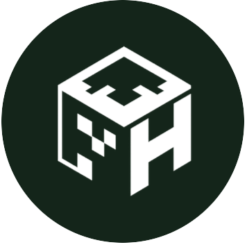

<h1 align="center">
    
    PocketHost
</h1>

PocketHost is an Android app for hosting and managing Minecraft servers from your phone. It is built for players, friends, and small communities that want practical server control without depending on a desktop PC for everyday administration.

> [!Note]
> This repository contains only the **source code for the PocketHost web presence and other web-based PocketHost utilities**.
> The **actual Android application code is maintained in a separate private repository** for security reasons and is **not open source**.

---

<h2 align="center"> Overview </h2>

PocketHost focuses on mobile-first server hosting with multiple ways for players to connect:

- Public relay access for players joining over the internet
- Local network access for players on the same Wi-Fi network
- Full Bedrock crossplay support, allowing Java and Bedrock players to join the same server

The app is designed to make server setup, administration, and player management feel straightforward on Android.

---

<h2 align="center"> Key Features </h2>

<table>
  <thead>
    <tr>
      <th>Feature</th>
      <th>Description</th>
    </tr>
  </thead>
  <tbody>
    <tr>
        <td>
            <strong>Server Hosting</strong>
        </td>
      <td>
        <ul>
            <li> Create and host Minecraft Java Edition servers directly on Android </li>
            <li> Select a Minecraft version before starting a server </li>
            <li> Start, stop, and restart servers from the app </li>
            <li> Keep server management accessible from anywhere on your phone </li>
        </ul>
      </td>
    </tr>
    <tr>
      <td>
        <strong> Dual Access & Crossplay </strong>
      </td>
      <td>
        <ul>
            <li> Share a public relay address for players outside your network </li>
            <li> Let nearby players join directly over local Wi-Fi </li>
            <li> Enable full crossplay between Java and Bedrock players </li>
            <li> Choose the connection method that fits your session or community </li>
        </ul>
      </td>
    </tr>
    <tr>
        <td>
            <strong> World Management </strong>
        </td>
        <td>
            <ul>
                <li>Back up worlds to Google Drive</li>
                <li>Restore saved worlds when needed</li>
                <li>Edit core world properties</li>
                <li>Review world data and storage usage</li>
            </ul>
        </td>
    </tr>
    <tr>
        <td>
            <strong> Player Controls </strong>
        </td>
        <td>
            <ul>
                <li>View the current player list</li>
                <li>Manage player actions from the app</li>
                <li>Teleport, damage, heal, feed, or starve players when appropriate</li>
                <li>Run commands through the in-app console</li>
                <li>See player connection status and IP information where supported</li>
            </ul>
        </td>
    </tr>
    <tr>
        <td>
            <strong> Plugins, Mods, and Customization </strong>
        </td>
        <td>
            <ul>
                <li>Browse mods and plugins in-app</li>
                <li>Discover content through Modrinth integration</li>
                <li>Full support for modded servers</li>
                <li>Search and filter by category or popularity</li>
                <li>Install selected items with a simple flow</li>
                <li>Manage plugins and mods without leaving the app</li>
            </ul>
        </td>
    </tr>
    <tr>
        <td>
            <strong> Advanced Controls </strong>
        </td>
        <td>
            <ul>
                <li>Customize server properties</li>
                <li>Use region options such as Global, North America, Europe, and Asia Pacific</li>
                <li>Keep APK delivery and update flow aligned with the app distribution process</li>
            </ul>
        </td>
    </tr>
  </tbody>
</table>

---

<h2 align="center"> Requirements </h2>

- Android 8.0 or newer
- At least 4 GB of RAM recommended
- Stable internet connection for relay-based access

---

<h2 align="center"> Getting Started </h2>

1. Install PocketHost on your Android phone.
2. Open the app and choose your server location if prompted.
3. Pick the Minecraft version you want to host.
4. Create or load a world.
5. Start the server.
6. Share the relay address or LAN address with your players.

---

<h2 align="center"> Links </h2>

- Official Discord: [Join the PocketHost Discord Community](https://dcd.gg/PocketCraft)

---

<h2 align="center"> License </h2>

All rights reserved.
